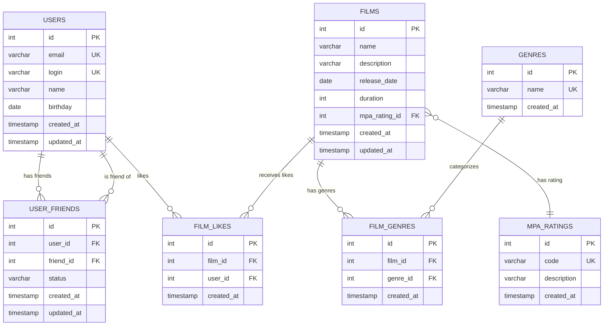

# Filmorate - Система рекомендаций фильмов

## Описание проекта

Filmorate - это REST API для системы рекомендаций фильмов, позволяющая пользователям:

- Регистрироваться и управлять профилем
- Добавлять фильмы в избранное
- Ставить лайки фильмам
- Добавлять друзей и управлять дружбой
- Получать рекомендации популярных фильмов

## Схема базы данных

## Структура таблиц

### Основные таблицы

#### 1. USERS (Пользователи)

- **id** - первичный ключ, автоинкремент
- **email** - уникальный email пользователя
- **login** - уникальный логин пользователя
- **name** - имя пользователя (может быть пустым)
- **birthday** - дата рождения
- **created_at/updated_at** - временные метки

#### 2. FILMS (Фильмы)

- **id** - первичный ключ, автоинкремент
- **name** - название фильма
- **description** - описание фильма (до 200 символов)
- **release_date** - дата релиза
- **duration** - продолжительность в минутах
- **mpa_rating_id** - внешний ключ на рейтинг MPA
- **created_at/updated_at** - временные метки

#### 3. GENRES (Жанры)

- **id** - первичный ключ, автоинкремент
- **name** - название жанра (Комедия, Драма, и т.д.)
- **created_at** - временная метка

#### 4. MPA_RATINGS (Рейтинги MPA)

- **id** - первичный ключ, автоинкремент
- **code** - код рейтинга (G, PG, PG-13, R, NC-17)
- **description** - описание рейтинга
- **created_at** - временная метка

### Связующие таблицы

#### 5. FILM_GENRES (Жанры фильмов)

- **id** - первичный ключ, автоинкремент
- **film_id** - внешний ключ на фильм
- **genre_id** - внешний ключ на жанр
- Уникальное ограничение на пару (film_id, genre_id)

#### 6. USER_FRIENDS (Дружба пользователей)

- **id** - первичный ключ, автоинкремент
- **user_id** - внешний ключ на пользователя
- **friend_id** - внешний ключ на друга
- **status** - статус дружбы (UNCONFIRMED, CONFIRMED)
- Уникальное ограничение на пару (user_id, friend_id)
- Ограничение: user_id != friend_id

#### 7. FILM_LIKES (Лайки фильмов)

- **id** - первичный ключ, автоинкремент
- **film_id** - внешний ключ на фильм
- **user_id** - внешний ключ на пользователя
- Уникальное ограничение на пару (film_id, user_id)

## API Endpoints

### Пользователи

| Метод  | Endpoint                                 | Описание                       |
|--------|------------------------------------------|--------------------------------|
| POST   | `/users`                                 | Создать пользователя           |
| PUT    | `/users`                                 | Обновить пользователя          |
| GET    | `/users`                                 | Получить всех пользователей    |
| GET    | `/users/{id}`                            | Получить пользователя по ID    |
| PUT    | `/users/{id}/friends/{friendId}`         | Добавить в друзья              |
| PUT    | `/users/{id}/friends/{friendId}/confirm` | Подтвердить дружбу             |
| DELETE | `/users/{id}/friends/{friendId}`         | Удалить из друзей              |
| GET    | `/users/{id}/friends`                    | Получить список друзей         |
| GET    | `/users/{id}/friends/confirmed`          | Получить подтверждённых друзей |
| GET    | `/users/{id}/friends/common/{otherId}`   | Получить общих друзей          |

### Фильмы

| Метод  | Endpoint                    | Описание                   |
|--------|-----------------------------|----------------------------|
| POST   | `/films`                    | Создать фильм              |
| PUT    | `/films`                    | Обновить фильм             |
| GET    | `/films`                    | Получить все фильмы        |
| GET    | `/films/{id}`               | Получить фильм по ID       |
| PUT    | `/films/{id}/like/{userId}` | Поставить лайк фильму      |
| DELETE | `/films/{id}/like/{userId}` | Убрать лайк с фильма       |
| GET    | `/films/popular`            | Получить популярные фильмы |
| GET    | `/films/genres`             | Получить все жанры         |
| GET    | `/films/genres/{id}`        | Получить жанр по ID        |
| GET    | `/films/mpa`                | Получить все рейтинги MPA  |
| GET    | `/films/mpa/{id}`           | Получить рейтинг MPA по ID |

## Запуск проекта

1. Клонируйте репозиторий
2. Установите зависимости: `mvn install`
3. Запустите приложение: `mvn spring-boot:run`
4. API будет доступно по адресу: `http://localhost:8080`

## Тестирование

Запустите тесты: `mvn test`