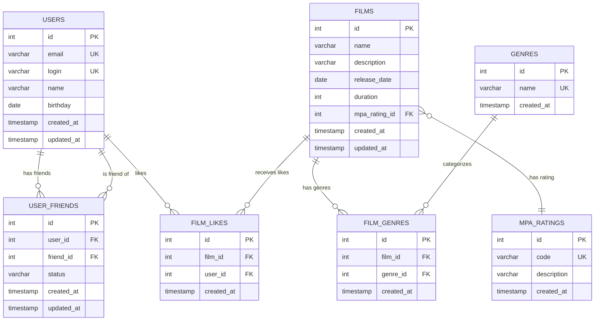

# Схема базы данных Filmorate

## ER-диаграмма

## Описание таблиц

### Основные таблицы

#### 1. USERS (Пользователи)
- **id** - первичный ключ, автоинкремент
- **email** - уникальный email пользователя
- **login** - уникальный логин пользователя
- **name** - имя пользователя (может быть пустым)
- **birthday** - дата рождения
- **created_at/updated_at** - временные метки

#### 2. FILMS (Фильмы)
- **id** - первичный ключ, автоинкремент
- **name** - название фильма
- **description** - описание фильма (до 200 символов)
- **release_date** - дата релиза
- **duration** - продолжительность в минутах
- **mpa_rating_id** - внешний ключ на рейтинг MPA
- **created_at/updated_at** - временные метки

#### 3. GENRES (Жанры)
- **id** - первичный ключ, автоинкремент
- **name** - название жанра (Комедия, Драма, и т.д.)
- **created_at** - временная метка

#### 4. MPA_RATINGS (Рейтинги MPA)
- **id** - первичный ключ, автоинкремент
- **code** - код рейтинга (G, PG, PG-13, R, NC-17)
- **description** - описание рейтинга
- **created_at** - временная метка

### Связующие таблицы

#### 5. FILM_GENRES (Жанры фильмов)
- **id** - первичный ключ, автоинкремент
- **film_id** - внешний ключ на фильм
- **genre_id** - внешний ключ на жанр
- Уникальное ограничение на пару (film_id, genre_id)

#### 6. USER_FRIENDS (Дружба пользователей)
- **id** - первичный ключ, автоинкремент
- **user_id** - внешний ключ на пользователя
- **friend_id** - внешний ключ на друга
- **status** - статус дружбы (UNCONFIRMED, CONFIRMED)
- Уникальное ограничение на пару (user_id, friend_id)
- Ограничение: user_id != friend_id

#### 7. FILM_LIKES (Лайки фильмов)
- **id** - первичный ключ, автоинкремент
- **film_id** - внешний ключ на фильм
- **user_id** - внешний ключ на пользователя
- Уникальное ограничение на пару (film_id, user_id)

## Представления (Views)

### 1. POPULAR_FILMS
Показывает фильмы с количеством лайков, отсортированные по популярности.

### 2. USER_FRIENDS_WITH_STATUS
Показывает друзей пользователя с их данными и статусом дружбы.

### 3. FILM_GENRES_LIST
Показывает фильмы с их жанрами в виде строки, разделенной запятыми.

## Индексы

Созданы индексы для оптимизации запросов:
- По email и login пользователей
- По дате релиза фильмов
- По внешним ключам
- По статусу дружбы
- Составные индексы для уникальных ограничений

## Принципы нормализации

1. **1NF**: Каждый столбец содержит только одно значение
2. **2NF**: Все неключевые атрибуты полностью зависят от первичного ключа
3. **3NF**: Нет транзитивных зависимостей между неключевыми атрибутами

## Поддержка бизнес-логики

Схема поддерживает все основные операции приложения:
- Получение всех фильмов и пользователей
- Получение топ N популярных фильмов (через представление)
- Получение списка друзей с учетом статуса
- Получение общих друзей
- Работа с жанрами и рейтингами MPA
- Система лайков
